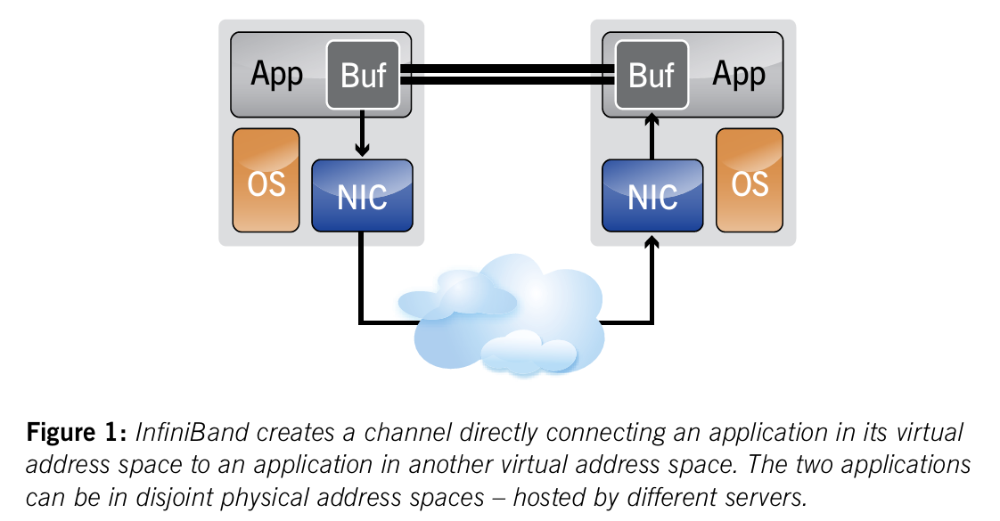
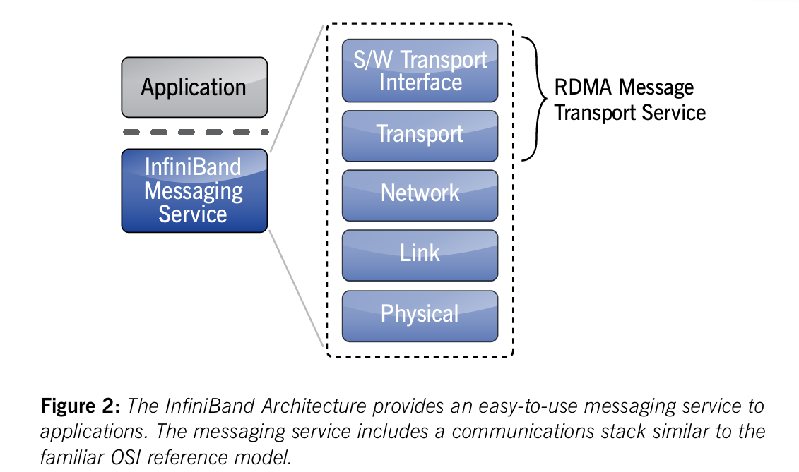
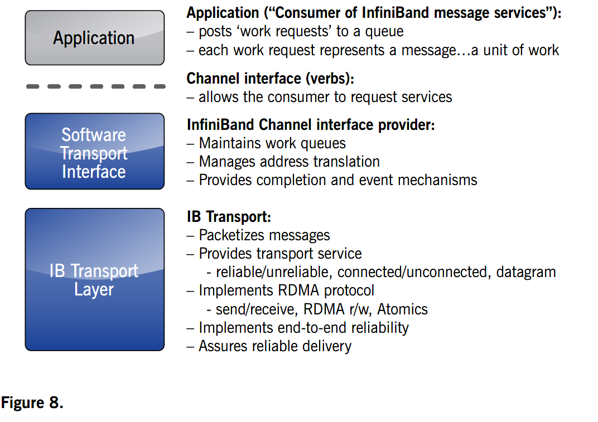
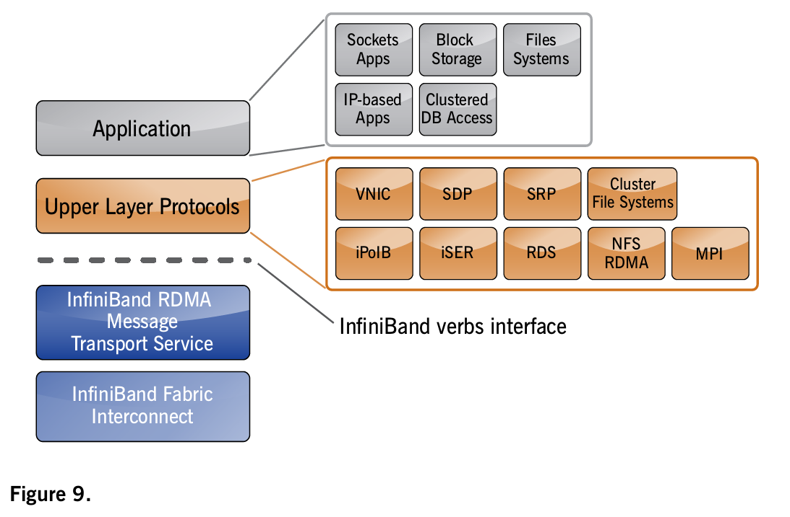

### Intro_To_Infiniband_For_End_Users_Notes

*本篇笔记专注与IB体系结构本身，对于IB衍生相关如应用场景等未做多的记录，部分内容待补充完善。若笔记中存在理解错误之处，还望指正，不甚感激。*

#### Introduction

- IB架构出现在1999年，作为Next Generation I/O 和 Future I/O的结合。这三者都基于VIA：Virtual 
  Interface Architecture。VIA两个基本概念：
  
  1. direct access to a network interface (e.g. a NIC) straight from application space
  
  2. an ability for applications to exchange data directly between their respective virtual buffers across a network
  
     **无需让操作系统直接参与所需的地址转换和网络进程**
     

- IB经常被拿来和TCP/IP/Ethernet进行比较。IB确实是有基于网络的概念也延用传统网络层的概念，但是两者之间差别比相似点更多。关键是IB提供应用可以直接访问的messaging service。任何要求应用程序在自己环境中与其他通信的情况都可以使用这种service。                                       

#### Chapter 1 Basic Concepts

+ 传统的network是依赖于os的，application依赖os提供通信服务

  传统的network centric 

  共享的网络资源比如TCP/IP网络栈或者相关网卡都是被os所独立拥有的，用户application无法访问

+ IB-**“application-centric” view**,提出问题：如何让一个application访问另一个application/storage简单高效且直接呢？ 传统的netwok显然不能满足这个要求，所以IB出现。

+ IB最初的目的就是给applications提供易使用的messaging service：applications，processes，access storage

+ IB架构：给每个application直接访问messaging service的权限（即不需要依赖os去传输） 。IB使用stack bypass的技术，避免了传统网络传输数据的一系列步骤（依赖os把数据从application的virtual buffer space->network stack->wire）。

+ IB在application与application之间建立了**channel**提供messaging service。这些application可以是user space下的也可以是kernel application（例如：file system） 

+ 对IB设计者而言挑战是在virtual address spaces之间建立channels要做到以下两点要求：

  1. 支持传输多种大小的messages

  2. 确保channels之间互不影响且受保护

+ 我们把每个channel的endpoints叫做**Queue Pairs**（QPs）。每个QP包括一个Send Queue和Receive Queue。如果一个application需要不止一个连接，那么就创建多个QPs。每个application利用QP去获取IB’s messaging service,为了避免牵扯到os，那么在每个channel终端的application要能直接的访问QPs：通过把QPs直接映射到每个application的虚拟地址空间实现。如此，在每个connection终端的application可以直接访问channel的虚拟地址。这是**Channel I/O**的概念。

+ 在有了channel+endpoints:QPs之后，还需要具体的传输方法。IB提供了两种传输方法。
  1. a **channel** semantic called SEND/RECEIVE 
     
     + 在接收方的receive queue里提前设置好数据结构
     + 发送方仅仅SENDS，接受方应用RECEIVES。发送方看不到接收方的buffer/data structure
     
  2. a pair of **memory**  semantics called RDMA READ and RDMA WRITE
  
     + 接收方应用在虚拟内存里面注册一个buffer
  
     + 把对buffer的控制权转给发送方
  
     + 发送方使用RDMA READ/RDMA WRITE操作在buffer里面读或写         
     
  
  e.g.:要存储一块数据：
  
     1. "initiator"把数据放到buffer中
  
     2. SEND操作给"target"（提供storage service）发送一个存储需求
  
     3. "target"RDMA READ从"initiator"虚拟缓存中拿到数据(此时"initiator"可以进行其他工作)
  
     4. 第三步完成后，"target"使用SEND操作返回结束状态通知"initiator"
  
  
  **注意以上例子是两种传输方法结合使用，一个管理channel，一个管理memory**

整体的实现架构如figure2所示，仍然需要一个完整的网络栈。与传统网络栈相比，传输消息更简单。

+ IB与传统网络另一个关键区别是：Work Request (WR)。S/W Transport Interface创建一个WR表明要在QP上执行一次message传输。message大小可以是<=2^31的任何大小。

+ TCP/IP是字节流的网络，一条message被分成多个packets，每个packets到达都要执行相对应的收操作。而IB是将一个完整的message进行传输。IB硬件自动拔message分成一系列packets，在IB网络中直接传输到application的虚拟缓存中，在这里进行重组成为一条完整的message，之后notify接收的application。

+ 具体是如何发送一条消息的呢？

  S/W Transport Interface定义了“verbs”的概念。verbs集合：是一组application使用从RDMA message transport service提出需求获取service的方法。例如："Post Send Request"

+ IB体系架构的硬件组成：

  + HCA-Host Channel Adapter:IB网络中的一个节点，有地址转换机制
  + TCA-Target Channel Adapter:嵌入式环境下使用
  + Switches：IB 链路层，flow control protocol,避免丢包。正常情况下，保证不会丢包。有利于实现IB要求的高效传输
  + Routers:可划分子网，可扩展性
  + Cables and Connectors

#### Chapter 2 Infiniband for HPC

利用IB的低延迟高性能以及channel架构为HPC服务

RDMA messaging service带来了 cpu几乎0利用率

关键词：*HPC, cluster performance, MPI, shared disk cluster file systems, parallel file systems*

#### Chapter 3 Infiniband for the Enterprise                                                                                                     

低CPU利用率，内存拷贝，节省CPU周期给application使用，减少对CPU需求

#### Chapter 4 Designing with Infiniband

+ OpenFabrics Alliance提供整套的各个软件部分：Open Fabrics Enterprise Distribution  即OFED。OFED提供的UpperLayerProtocols(ULPs)可以让一个已经存在的应用轻松利用IB。每个ULP分成两个接口，一个面向上层应用程序的接口，一个与下层S/W Software Interface中定义的QPs联系 。

+ ULPs有：SDP,SRP,iSER,

  ​             IPoIB：与其他TCP/IP，UDP，SCTP等其他网络中应用通信             

  ​             等如图9

  

+ 传统的API提供针对某一种的服务。例如SOCKET API，给应用提供获取网络服务的方式，也与底层的TCP/IP网络相关联。现在数据中心网络认为由三种互联组成：network,storage,IPC。每种要有自己的物理层，协议栈，以及一套应用层API。但是，在IB体系架构中ULPs提供一系列接口使得应用可以同时获得network service,storage service,IPC service 等，并且这些服务都是用同一种下层网络。

  #### Chapter 5 Infiniband Architecture and Features

  
